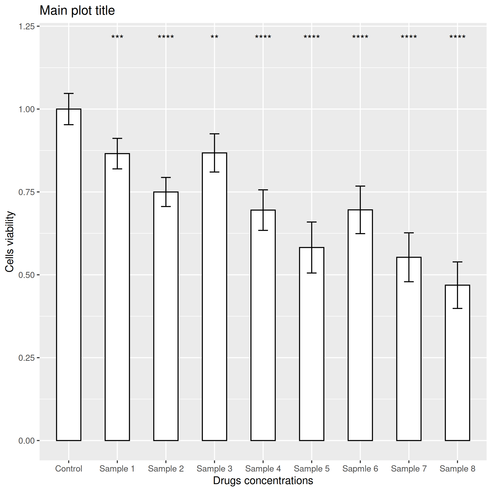

# Data processing script for raw MTT analysis files

This simple R script is devoted to processing raw [MTT assay](https://en.wikipedia.org/wiki/MTT_assay) data on the fly.

## Dependencies

 1. [R](https://www.r-project.org/) 
 2. Addition packages (will be installed on first run):

    * readxl
    * reshape2
    * rstatix
    * ggpubr

## Input data format

Only one file can be processed per run. Raw data should be in .xls or .xlsx format (please, see [example_mtt_data](example_mtt_data.xls)) and correspond with location of the samples on the 96-well plate. Each column corresponds to each sample, wells B to G is a sample replicates. 

Rows A and H and columns 1 and 12 will not be considered in processing, as their data is incorrect due to [edge effect](https://www.researchgate.net/publication/341902684_Evaluation_of_plate_edge_effects_in_in-vitro_cell_based_assay).

## User interactions

The script supports interaction with user:

  * Customize a number of samples (from 1 to 10)
  * Customize a number of samples replicates (from 1 to 6)
  * User-defined sample (columns) names
  * User-defined reference sample for measuring relative survival
  * User-defined titles of X and Y axis and a main plot title
  * Saving directory and file name is user-defined
  * File type (png, eps, ps, tex (pictex), pdf, jpeg, tiff, bmp, svg or wmf) is also user-defined
  * User-defined statistic method (T-test or Mann-Whitney U test) for comparison the reference sample with other samples
  
## Usage

  Clone this repository `git clone https://github.com/bi0mark/MTT_assay_analyser` or download all files as archive ("Code" -> "Download ZIP"). Pathway to script file should not contain any Cyrillic symbols. 
  
  To edit script or run it in step-by-step mode you should use an IDE such as [Rstudio](https://www.rstudio.com/). If you want to work in a console, use a "\_console" version of the script and following instructions:

### Linux

  1. Open a console in script folder 
  2. Type `Rscript ./mtt_from_xlsx_console.R`
  3. Follow script instructions
  
### Windows

  1. Right click on the file "mtt_from_xlsx_console.R" file -> "Open with..." -> "Choose another app" -> scroll down apps list and click "Find other app on this computer"
  2. Find Rscript.exe application, it usually located in C:/Program files/R/R-"version"/bin/ and select it
  3. Follow script instructions

## Output results
The output is a bar plot with error bars (standard deviation) and statistic significance (displayed as \*) based on T-test or Mann-Whitney U test. Statistic difference is measure between reference sample and other samples.

